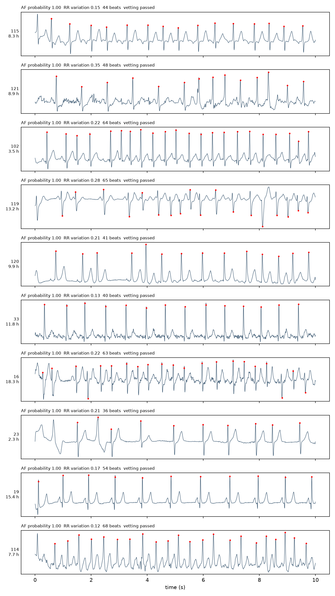

# HeartScreen

[](https://github.com/jasonjesuraja06/heartscreen/actions/workflows/ci.yml)

Arrhythmia discovery engine for single-lead wearable ECG: a JAX/Flax residual
CNN classifier for the PhysioNet/CinC 2017 task, wrapped in a screening
pipeline that ranks candidate AF episodes in multi-hour recordings.

Atrial fibrillation is intermittent and often asymptomatic, so it is missed by
spot checks and found by long-duration monitoring, which produces far more
signal than anyone reads by hand. HeartScreen trains a compact
821k-parameter classifier on labeled 30 s single-lead records and makes it
the cheap first tier of a screening stack. The model scans a long recording
window by window, R-peak and signal-quality checks vet whatever it flags,
and the survivors reach a human as a ranked candidate list.

## Results

Stratified 5-fold cross-validation on the 8,528-record public training set,
revised (v3) labels, scored with the official challenge metric (mean F1 over
Normal, AF, Other). The official hidden test set was never released; see the
protocol notes below.

| Metric | Value |
|---|---|
| Mean CV challenge F1 | 0.827 +/- 0.008 |
| Per-class F1, Normal / AF / Other / Noisy | 0.903 / 0.810 / 0.768 / 0.614 |
| RR-feature logistic regression baseline | 0.547 +/- 0.022 |
| Model size | 821,348 parameters |
| Training throughput (M4 Pro CPU) | 140 windows/s |

For context, the four winning 2017 entries scored 0.83 on the withheld test
set, a protocol not directly comparable to cross-validation; the baseline row
shows what the screening pipeline's own hand-built rhythm features achieve
under the identical protocol. Details in [docs/results.md](docs/results.md).

Screening the MIT-BIH Long-Term AF Database with the deployment model, on
the same CPU:

| Metric | Value |
|---|---|
| Recording-hours screened | 1,961 (84 Holter recordings) |
| End-to-end wall clock | 15.3 min (127.8 recording-hours/min) |
| Window-level sensitivity / specificity | 0.921 / 0.963 |
| Windows scored | 470,460 (52.7% annotated AF) |

PPV is 0.965, but the cohort is AF-enriched, so it does not transfer to
low-prevalence populations. Full tables, figures, and reproduction commands:
[docs/results.md](docs/results.md).

Top-ranked candidate episodes from the screening run, with detected R-peaks
and per-episode vetting evidence:



## Quickstart

Requires [uv](https://docs.astral.sh/uv/); it installs the pinned Python
interpreter and locked dependencies.

```
uv sync
./scripts/download_cinc2017.sh
uv run python -m heartscreen.evaluate --smoke        # ~10 s end-to-end check
uv run python -m heartscreen.evaluate                # full 5-fold CV, hours
```

Screening additionally needs the deployment model and the LTAF data:

```
./scripts/download_ltafdb.sh
uv run python -m heartscreen.train                   # train on all records
uv run python -m heartscreen.screening               # rank candidates
```

## Layout

```
heartscreen/
  data.py            CinC 2017 loading, labels, preprocessed cache
  preprocessing.py   bandpass, normalization, windowing, batching
  models.py          residual 1D CNN with mask-aware normalization
  train.py           fold training, jit steps, deployment training entry
  evaluate.py        stratified CV driver, challenge metric
  screening.py       sliding-window inference, vetting, candidate ranking
configs/             default and smoke configurations
docs/                design rationale, results, figures
scripts/             dataset downloads, dataset figures, jit benchmark
tests/               unit tests; data-dependent tests skip without data
```

## Evaluation protocol and limitations

The CinC 2017 hidden test set is not public, so all classifier numbers are
stratified 5-fold cross-validation on the public training set with a fixed
seed; published hidden-test scores from challenge entries are cited in
docs/results.md as context and are not directly comparable. Each fold's
final-epoch model is evaluated, with no early stopping or model selection on
the validation fold. Folds split records; patient identities are not
published for this dataset, so patient-level splitting is not possible.
Screening agreement on LTAF is measured across an acquisition mismatch the
model never saw in training (128 Hz Holter telemetry resampled to 300 Hz)
and the vetting thresholds are ranking heuristics, not diagnostic rules.

HeartScreen is a research prototype and is not a medical device.

## License

MIT
