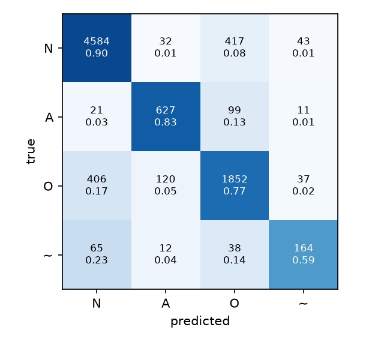
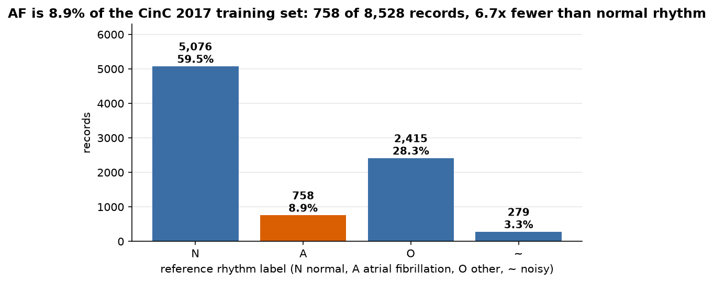
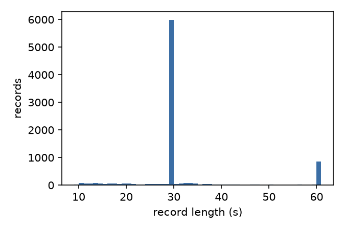
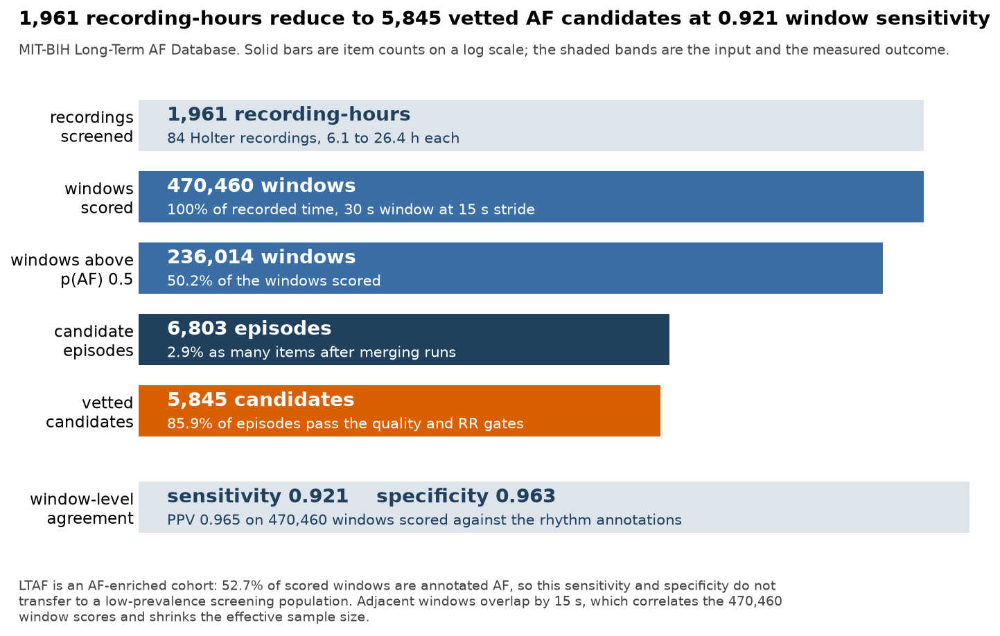

# Results

All numbers were produced by the commands shown, on an Apple M4 Pro (14-core
CPU, 48 GB RAM, no GPU, JAX CPU backend), with seed 42. The raw artifacts
behind the cross-validation, screening, and cohort tables (per-fold logs and
summaries, screening outputs and run logs, the baseline feature table, and
the trained parameters) are attached to
[release v1.0.0](https://github.com/jasonjesuraja06/heartscreen/releases/tag/v1.0.0).
The component timings at the end are stdout measurements, reproduced by the
commands beside them.

## Cross-validation

Stratified 5-fold cross-validation on the 8,528-record CinC 2017 public
training set with revised v3 labels, scored with the official challenge
metric: mean per-class F1 over Normal, AF, and Other. Each fold trains
60 epochs and the final-epoch model is evaluated; no early stopping or
best-epoch selection touches the validation fold.

```
uv run python -m heartscreen.evaluate --config configs/default.yaml
cp results/cv/confusion.png docs/figures/confusion_cv.png
```

| Fold | Challenge F1 | F1 N | F1 A | F1 O | F1 ~ |
|---|---|---|---|---|---|
| 0 | 0.8296 | 0.903 | 0.811 | 0.775 | 0.647 |
| 1 | 0.8299 | 0.906 | 0.815 | 0.769 | 0.660 |
| 2 | 0.8153 | 0.907 | 0.772 | 0.767 | 0.613 |
| 3 | 0.8208 | 0.905 | 0.788 | 0.770 | 0.547 |
| 4 | 0.8398 | 0.895 | 0.865 | 0.760 | 0.606 |
| mean +/- std | 0.8271 +/- 0.0084 | | | | |

Pooled over all validation folds (every record predicted exactly once):

| Metric | Value |
|---|---|
| Pooled challenge F1 | 0.827 |
| Pooled F1 N / A / O / ~ | 0.903 / 0.810 / 0.768 / 0.614 |
| Wall clock, 5 folds | 4.31 h (15,509 s), mean epoch 51.6 s |



The dominant confusion is Normal vs Other in both directions (417 Normal
records predicted Other, 406 Other predicted Normal), consistent with Other
being a heterogeneous class that includes near-normal rhythms. AF recall is
0.83, with most misses going to Other (99 of 131). Noisy recall is 0.59 and
its errors are mostly absorbed into Normal; the class has only 279 records,
so its F1 is high-variance and it is excluded from the challenge score by
definition.

## Baseline

A logistic regression over the screening pipeline's own hand-built features
(XQRS beat rate, CV(RR), RMSSD, flatline fraction, 5 to 25 Hz power ratio)
under the identical folds and metric scores 0.547 +/- 0.022; mean per-class
F1 is 0.82 / 0.42 / 0.40 / 0.34 for N / A / O / ~. Rhythm-irregularity
features alone reach about half the network's AF F1, so most of the headline
gap of 0.28 comes from learned morphology.

```
uv run python scripts/baseline_rr.py
```

## Dataset

| Class | Records | Share |
|---|---|---|
| Normal (N) | 5,076 | 59.5% |
| AF (A) | 758 | 8.9% |
| Other (O) | 2,415 | 28.3% |
| Noisy (~) | 279 | 3.3% |

Record lengths run 9.0 to 61.0 s (median 30.0, mean 32.5) at 300 Hz.




## Context: published challenge scores

The official hidden test set was never released, so the numbers above are
cross-validation on the public training set and are not directly comparable
to hidden-test scores. For context, the four winning entries of the 2017
challenge (Teijeiro et al., Datta et al., Zabihi et al., Hong et al.) each
scored 0.83 on the hidden test set with feature-engineering ensembles, per
the challenge overview (Clifford et al., "AF Classification from a Short
Single Lead ECG Recording: the PhysioNet/Computing in Cardiology Challenge
2017", CinC 2017).

## Screening on the MIT-BIH Long-Term AF Database

The deployment model (trained on all 8,528 records with the CV-validated
recipe) scans 84 Holter recordings of 6.1 to 26.4 hours (mean 23.3, median
24.0), resampled from 128 Hz to 300 Hz, with a 30 s window and 15 s stride.

```
uv run python -m heartscreen.train --config configs/default.yaml
uv run python -m heartscreen.screening
cp results/screening/top_candidates.png docs/figures/top_candidates.png
```

| Metric | Value |
|---|---|
| Recording-hours screened | 1,961 (84 records) |
| End-to-end wall clock | 15.3 min (127.8 recording-hours/min) |
| Candidate episodes | 6,803 |
| Candidates passing vetting | 5,845 (85.9%) |
| Windows scored against annotations | 470,460 (52.7% annotated AF) |
| Window-level sensitivity | 0.921 |
| Window-level specificity | 0.963 |
| Window-level PPV | 0.965 |
| Vetted candidates majority-AF by annotation | 75.7% |
| Vetted candidates overlapping any annotated AF | 78.3% |

Window-level truth is at least half the window annotated AFIB or AFL; a
window predicts AF when its argmax class is A. LTAF is an AF-enriched cohort
(52.7% of scored windows are AF), so the PPV does not transfer to
low-prevalence screening populations. Adjacent windows overlap by 15 s,
which correlates the 470,460 window scores and shrinks the effective sample
size. The classifier also never saw Holter data in training: it was fit on
300 Hz AliveCor snippets and applied to 128 Hz telemetry resampled up, and
the numbers absorb that mismatch.

The funnel below reads each stage count back out of `results/screening/`, so
it reports the same run as the table above:

```
uv run python scripts/dataset_figures.py --figures funnel
```



Three top-ranked candidates and, in the last panel, the highest-scoring
episode vetting rejected (QRS-band power ratio 0.296 against a 0.30 gate):


## Healthy-cohort false alarms

The same pipeline over the MIT-BIH Normal Sinus Rhythm Database (18 subjects
with no significant arrhythmias, 437 recording-hours) raises 25 candidate
episodes, of which 16 survive vetting: 0.9 vetted candidates per patient-day.
Fifteen of the 18 subjects produce no vetted candidate at all, and a single
subject accounts for 14 of the 16.

```
./scripts/download_nsrdb.sh
uv run python -m heartscreen.screening --data-dir data/nsrdb --out-dir results/screening_nsrdb
```

## Component timings

| Measurement | Value | Command |
|---|---|---|
| Preprocessing cache, 8,528 records | 5.2 s | one-time, run by evaluate on first use |
| Train step, jit, batch 64 | 455.9 ms | `uv run python scripts/bench_jit.py` |
| Train step, eager, batch 64 | 719.8 ms | `uv run python scripts/bench_jit.py` |
| jit speedup | 1.6x | same |
| Training throughput | 140 windows/s | same |
| Epoch, 6,822 train records | 51.6 s mean over 60 | CV run, written to results/cv/fold0/log.csv |
| Smoke run, end to end | 10.2 s | `time uv run python -m heartscreen.evaluate --smoke` |
| Deployment model, 8,528 records, 60 epochs | 61.4 min (61.4 s/epoch mean) | `uv run python -m heartscreen.train` |
